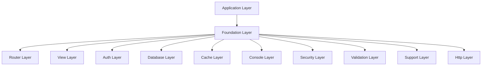

# TreeHouse Framework - Architecture

## System Architecture

TreeHouse follows a **layered, modular architecture** with clear separation of concerns. The framework is organized into distinct layers that work together to provide a comprehensive web development solution.

### Core Architecture Layers



## Source Code Paths

### Core Framework (`src/TreeHouse/`)
- **Foundation/**: Application container, dependency injection, bootstrapping
  - [`Application.php`](src/TreeHouse/Foundation/Application.php) - Main application class, service registration
  - [`Container.php`](src/TreeHouse/Foundation/Container.php) - DI container with automatic resolution
- **Database/**: ORM, query builder, migrations
  - [`ActiveRecord.php`](src/TreeHouse/Database/ActiveRecord.php) - Base model class with relationships
  - [`QueryBuilder.php`](src/TreeHouse/Database/QueryBuilder.php) - SQL query builder
  - [`Connection.php`](src/TreeHouse/Database/Connection.php) - PDO wrapper
  - [`Relations/`](src/TreeHouse/Database/Relations/) - Relationship implementations
- **Router/**: URL routing and middleware
  - [`Router.php`](src/TreeHouse/Router/Router.php) - Main routing engine
  - [`RouteCollection.php`](src/TreeHouse/Router/RouteCollection.php) - Route registry
  - [`Middleware/`](src/TreeHouse/Router/Middleware/) - HTTP middleware
- **Auth/**: Authentication and authorization
  - [`AuthManager.php`](src/TreeHouse/Auth/AuthManager.php) - Auth service orchestrator
  - [`SessionGuard.php`](src/TreeHouse/Auth/SessionGuard.php) - Session-based authentication
  - [`Gate.php`](src/TreeHouse/Auth/Gate.php) - Authorization gate for permissions
- **View/**: Template engine and rendering
  - [`ViewFactory.php`](src/TreeHouse/View/ViewFactory.php) - View factory and management
  - [`ViewEngine.php`](src/TreeHouse/View/ViewEngine.php) - Template compilation
  - [`Compilers/`](src/TreeHouse/View/Compilers/) - Template processors
- **Console/**: CLI framework
  - [`Application.php`](src/TreeHouse/Console/Application.php) - CLI application runner
  - [`Commands/`](src/TreeHouse/Console/Commands/) - Built-in commands
- **Security/**: Security features
  - [`Hash.php`](src/TreeHouse/Security/Hash.php) - Password hashing
  - [`Csrf.php`](src/TreeHouse/Security/Csrf.php) - CSRF protection
  - [`Encryption.php`](src/TreeHouse/Security/Encryption.php) - AES-256-CBC encryption
- **Validation/**: Input validation
  - [`Validator.php`](src/TreeHouse/Validation/Validator.php) - Main validator
  - [`Rules/`](src/TreeHouse/Validation/Rules/) - 25+ validation rules
- **Support/**: Utility classes
  - [`Collection.php`](src/TreeHouse/Support/Collection.php) - Array collection helper
  - [`Carbon.php`](src/TreeHouse/Support/Carbon.php) - Date/time manipulation
  - [`Str.php`](src/TreeHouse/Support/Str.php) - String utilities

### Application Layer (`src/App/`)
- **Controllers/**: Application controllers
- **Models/**: Application models extending ActiveRecord

### Configuration (`config/`)
- [`app.php`](config/app.php) - Application settings
- [`database.php`](config/database.php) - Database connections
- [`auth.php`](config/auth.php) - Authentication configuration
- [`view.php`](config/view.php) - Template engine settings
- [`routes/`](config/routes/) - Route definitions

### Entry Points
- [`public/index.php`](public/index.php) - HTTP request handler
- [`bin/treehouse`](bin/treehouse) - CLI entry point

## Key Technical Decisions

### 1. **Zero External Dependencies**
- All functionality implemented in pure PHP 8.4+
- Only requires standard PHP extensions (PDO, JSON, mbstring, OpenSSL, fileinfo, filter)
- Self-contained ecosystem eliminates dependency management complexity

### 2. **Laravel-Inspired API Design**
- Familiar method signatures for easy migration from Laravel
- Similar patterns for models, controllers, routing, and views
- Maintains Laravel conventions while being completely independent

### 3. **Service Container with Auto-Wiring**
- Dependency injection container with automatic resolution
- Constructor injection support
- Singleton and transient service lifetimes
- Circular dependency detection

### 4. **ActiveRecord ORM Pattern**
- Eloquent-style models with magic methods
- Relationship support (hasOne, hasMany, belongsTo, belongsToMany)
- Query scopes and model events
- Mass assignment protection with fillable/guarded

### 5. **Custom Template Engine**
- HTML-valid template syntax
- Server-side rendering with caching
- Auth integration and conditional rendering
- Component-based architecture

## Design Patterns in Use

### 1. **MVC (Model-View-Controller)**
- Clear separation between data (Models), presentation (Views), and logic (Controllers)
- Models extend ActiveRecord base class
- Controllers handle HTTP requests and return responses
- Views use template engine for rendering

### 2. **Service Container Pattern**
- Central registry for all application services
- Automatic dependency resolution via reflection
- Lazy loading of services

### 3. **Active Record Pattern**
- Models represent database tables
- Models contain both data and behavior
- Direct mapping between object attributes and database columns

### 4. **Repository Pattern** (via QueryBuilder)
- Query builders abstract database operations
- Fluent interface for building complex queries
- Separation of query logic from business logic

### 5. **Facade Pattern** (via Helper Functions)
- Simple interfaces to complex subsystems
- Global helper functions provide easy access to framework features
- Examples: `auth()`, `cache()`, `view()`

## Component Relationships

### Request Lifecycle
1. **HTTP Request** → `public/index.php`
2. **Application Bootstrap** → Foundation/Application.php
3. **Service Registration** → Foundation/Container.php
4. **Route Resolution** → Router/Router.php
5. **Controller Dispatch** → Application controllers
6. **Response Generation** → Http/Response.php

### Database Flow
1. **Model Query** → Database/ActiveRecord.php
2. **Query Building** → Database/QueryBuilder.php
3. **Connection Management** → Database/Connection.php
4. **Result Hydration** → Back to ActiveRecord models

### Authentication Flow
1. **Auth Request** → Auth/AuthManager.php
2. **Guard Selection** → Auth/SessionGuard.php
3. **User Provider** → Auth/DatabaseUserProvider.php
4. **Authorization** → Auth/Gate.php

## Critical Implementation Paths

### 1. **Application Bootstrapping**
```
Foundation/Application::__construct()
├── Container initialization
├── Environment loading (Support/Env)
├── Configuration loading
├── Service registration
└── Route loading
```

### 2. **Request Handling**
```
Application::handle(Request)
├── Router::dispatch()
├── Middleware execution
├── Controller resolution
├── Method invocation
└── Response generation
```

### 3. **Database Operations**
```
ActiveRecord::save()
├── Attribute validation
├── Timestamp updates
├── QueryBuilder::insert/update
└── Connection::execute()
```

### 4. **Template Rendering**
```
ViewFactory::make()
├── Template location
├── ViewEngine::compile()
├── Cache checking
├── PHP execution
└── HTML output
```

## Security Architecture

### 1. **Input Sanitization**
- Automatic escaping in templates
- Validation rules for all inputs
- SQL injection prevention via prepared statements

### 2. **Authentication Security**
- Secure password hashing (PHP password_hash)
- Session management with security headers
- CSRF protection for state-changing operations

### 3. **Data Protection**
- AES-256-CBC encryption for sensitive data
- Secure random token generation
- Mass assignment protection in models

## Performance Considerations

### 1. **Caching Strategy**
- Template compilation caching
- File-based application cache
- Query result caching capability

### 2. **Lazy Loading**
- Services loaded on-demand
- Relationship lazy loading
- Configuration lazy loading

### 3. **Memory Management**
- Efficient collection handling
- Connection pooling (single connection reuse)
- Minimal object creation overhead