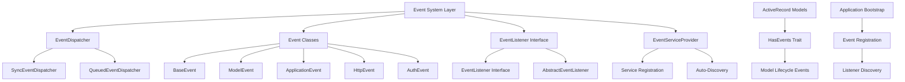

# TreeHouse Framework Event System - Comprehensive Implementation Plan

## Overview

This document outlines the complete implementation plan for adding a comprehensive event system to the TreeHouse framework. The event system will enable loose coupling, extensible architecture, and systematic tracking of application lifecycle events while maintaining TreeHouse's zero-dependency philosophy.

## Architecture Overview

The event system will be implemented as a new layer in the TreeHouse framework, following the same patterns as existing layers (Foundation, Database, Router, etc.). It will integrate with:

- **Foundation Layer**: Service registration and dependency injection
- **Database Layer**: Model lifecycle events via ActiveRecord integration
- **Auth Layer**: Authentication events (login, logout, failed attempts)
- **Cache Layer**: Cache operation events
- **Error Layer**: Exception and error events
- **Router Layer**: HTTP request lifecycle events

## Core Architecture Design



## Implementation Phases

### Phase 1: Core Event Infrastructure (Week 1)

#### 1.1 Event Dispatcher System

**File**: `src/TreeHouse/Events/EventDispatcher.php`
```php
<?php

declare(strict_types=1);

namespace LengthOfRope\TreeHouse\Events;

interface EventDispatcher
{
    public function dispatch(object $event): object;
    public function listen(string $eventClass, callable|string $listener): void;
    public function forget(string $eventClass): void;
    public function hasListeners(string $eventClass): bool;
    public function getListeners(string $eventClass): array;
}
```

**File**: `src/TreeHouse/Events/SyncEventDispatcher.php`
- Synchronous event dispatching
- Immediate listener execution
- Exception handling and propagation
- Event cancellation support

**File**: `src/TreeHouse/Events/QueuedEventDispatcher.php`
- Asynchronous event dispatching
- Queue integration (future implementation)
- Background processing support

#### 1.2 Event Base Classes

**File**: `src/TreeHouse/Events/Event.php`
```php
<?php

declare(strict_types=1);

namespace LengthOfRope\TreeHouse\Events;

abstract class Event
{
    public readonly float $timestamp;
    public readonly string $eventId;
    protected bool $propagationStopped = false;
    
    public function __construct()
    {
        $this->timestamp = microtime(true);
        $this->eventId = uniqid('event_', true);
    }
    
    public function stopPropagation(): void
    {
        $this->propagationStopped = true;
    }
    
    public function isPropagationStopped(): bool
    {
        return $this->propagationStopped;
    }
}
```

**File**: `src/TreeHouse/Events/ModelEvent.php`
```php
<?php

declare(strict_types=1);

namespace LengthOfRope\TreeHouse\Events;

use LengthOfRope\TreeHouse\Database\ActiveRecord;

abstract class ModelEvent extends Event
{
    public function __construct(
        public readonly ActiveRecord $model,
        public readonly array $context = []
    ) {
        parent::__construct();
    }
}
```

#### 1.3 Event Listener System

**File**: `src/TreeHouse/Events/EventListener.php`
```php
<?php

declare(strict_types=1);

namespace LengthOfRope\TreeHouse\Events;

interface EventListener
{
    public function handle(object $event): void;
    public function shouldQueue(): bool;
    public function getQueue(): ?string;
}
```

**File**: `src/TreeHouse/Events/AbstractEventListener.php`
- Base implementation with common functionality
- Queue configuration support
- Error handling patterns

#### 1.4 Service Provider Integration

**File**: `src/TreeHouse/Events/EventServiceProvider.php`
```php
<?php

declare(strict_types=1);

namespace LengthOfRope\TreeHouse\Events;

class EventServiceProvider
{
    protected array $listen = [];
    
    public function register(Container $container): void
    {
        // Register event dispatcher
        $container->singleton('events', function () use ($container) {
            $config = $container->make('config')->get('events', []);
            $dispatcher = $config['default_dispatcher'] ?? 'sync';
            
            return match ($dispatcher) {
                'sync' => new SyncEventDispatcher($container),
                'queue' => new QueuedEventDispatcher($container),
                default => new SyncEventDispatcher($container)
            };
        });
        
        // Auto-discover and register listeners
        $this->discoverListeners($container);
    }
}
```

### Phase 2: Model Integration (Week 2)

#### 2.1 HasEvents Trait for ActiveRecord

**File**: `src/TreeHouse/Events/Concerns/HasEvents.php`
```php
<?php

declare(strict_types=1);

namespace LengthOfRope\TreeHouse\Events\Concerns;

use LengthOfRope\TreeHouse\Events\Events\ModelCreating;
use LengthOfRope\TreeHouse\Events\Events\ModelCreated;
// ... other model events

trait HasEvents
{
    protected static array $modelEvents = [
        'creating', 'created', 'updating', 'updated', 
        'deleting', 'deleted', 'saving', 'saved'
    ];
    
    protected function fireModelEvent(string $event, bool $halt = true): mixed
    {
        if (!isset(static::$dispatcher)) {
            return true;
        }
        
        $method = $halt ? 'until' : 'dispatch';
        $result = static::$dispatcher->{$method}(
            $this->newModelEvent($event)
        );
        
        return $halt ? $result !== false : $result;
    }
    
    protected function newModelEvent(string $event): object
    {
        return match ($event) {
            'creating' => new ModelCreating($this),
            'created' => new ModelCreated($this),
            'updating' => new ModelUpdating($this),
            'updated' => new ModelUpdated($this),
            'deleting' => new ModelDeleting($this),
            'deleted' => new ModelDeleted($this),
            'saving' => new ModelSaving($this),
            'saved' => new ModelSaved($this),
            default => throw new \InvalidArgumentException("Unknown model event: {$event}")
        };
    }
}
```

#### 2.2 Model Event Classes

**Directory**: `src/TreeHouse/Events/Events/`
- `ModelCreating.php` - Before model creation (cancellable)
- `ModelCreated.php` - After model creation
- `ModelUpdating.php` - Before model update (cancellable)
- `ModelUpdated.php` - After model update
- `ModelDeleting.php` - Before model deletion (cancellable)
- `ModelDeleted.php` - After model deletion
- `ModelSaving.php` - Before save operation (cancellable)
- `ModelSaved.php` - After save operation

#### 2.3 ActiveRecord Integration

Modify `src/TreeHouse/Database/ActiveRecord.php`:
```php
// Add to ActiveRecord class
use LengthOfRope\TreeHouse\Events\Concerns\HasEvents;

abstract class ActiveRecord
{
    use HasEvents;
    
    protected static ?EventDispatcher $dispatcher = null;
    
    public static function setEventDispatcher(?EventDispatcher $dispatcher): void
    {
        static::$dispatcher = $dispatcher;
    }
    
    // Modify save() method
    public function save(): bool
    {
        if ($this->fireModelEvent('saving') === false) {
            return false;
        }
        
        if ($this->exists) {
            if ($this->fireModelEvent('updating') === false) {
                return false;
            }
            $saved = $this->performUpdate();
            if ($saved) {
                $this->fireModelEvent('updated', false);
            }
        } else {
            if ($this->fireModelEvent('creating') === false) {
                return false;
            }
            $saved = $this->performInsert();
            if ($saved) {
                $this->fireModelEvent('created', false);
            }
        }
        
        if ($saved) {
            $this->fireModelEvent('saved', false);
        }
        
        return $saved;
    }
    
    // Modify delete() method
    public function delete(): bool
    {
        if (!$this->exists) {
            return false;
        }
        
        if ($this->fireModelEvent('deleting') === false) {
            return false;
        }
        
        $deleted = static::query()
            ->where($this->getKeyName(), $this->getKey())
            ->delete();
        
        if ($deleted > 0) {
            $this->exists = false;
            $this->fireModelEvent('deleted', false);
            return true;
        }
        
        return false;
    }
}
```

### Phase 3: Application Events (Week 3)

#### 3.1 Application Lifecycle Events

**File**: `src/TreeHouse/Events/Events/ApplicationBooting.php`
**File**: `src/TreeHouse/Events/Events/ApplicationBooted.php`
**File**: `src/TreeHouse/Events/Events/ApplicationTerminating.php`

#### 3.2 HTTP Request Events

**File**: `src/TreeHouse/Events/Events/RequestReceived.php`
**File**: `src/TreeHouse/Events/Events/ResponseSending.php`
**File**: `src/TreeHouse/Events/Events/RequestHandled.php`

#### 3.3 Authentication Events

**File**: `src/TreeHouse/Events/Events/UserLoggedIn.php`
**File**: `src/TreeHouse/Events/Events/UserLoggedOut.php`
**File**: `src/TreeHouse/Events/Events/LoginFailed.php`

#### 3.4 Cache Events

**File**: `src/TreeHouse/Events/Events/CacheHit.php`
**File**: `src/TreeHouse/Events/Events/CacheMiss.php`
**File**: `src/TreeHouse/Events/Events/CacheCleared.php`

### Phase 4: Advanced Features (Week 4)

#### 4.1 Event Configuration

**File**: `config/events.php`
```php
<?php

return [
    'default_dispatcher' => env('EVENT_DISPATCHER', 'sync'),
    
    'dispatchers' => [
        'sync' => \LengthOfRope\TreeHouse\Events\SyncEventDispatcher::class,
        'queue' => \LengthOfRope\TreeHouse\Events\QueuedEventDispatcher::class,
    ],
    
    'auto_discovery' => [
        'enabled' => true,
        'paths' => [
            'src/App/Listeners',
        ],
        'cache' => env('EVENT_CACHE_DISCOVERY', true),
    ],
    
    'model_events' => [
        'enabled' => true,
        'events' => ['creating', 'created', 'updating', 'updated', 'deleting', 'deleted', 'saving', 'saved'],
    ],
    
    'debugging' => [
        'enabled' => env('APP_DEBUG', false),
        'log_events' => env('LOG_EVENTS', false),
        'log_listeners' => env('LOG_LISTENERS', false),
        'performance_monitoring' => true,
    ],
    
    'listeners' => [
        // Event => [Listeners]
        \LengthOfRope\TreeHouse\Events\Events\UserLoggedIn::class => [
            \App\Listeners\SendWelcomeEmail::class,
            \App\Listeners\UpdateUserStatistics::class,
        ],
    ],
];
```

#### 4.2 Event Broadcasting (Future)

**File**: `src/TreeHouse/Events/Broadcasting/BroadcastManager.php`
- WebSocket integration
- Real-time event broadcasting
- Channel management

#### 4.3 Event Debugging Tools

**File**: `src/TreeHouse/Events/Debug/EventProfiler.php`
- Event execution timing
- Memory usage tracking
- Listener performance monitoring

#### 4.4 CLI Commands

**File**: `src/TreeHouse/Console/Commands/EventCommands/EventListCommand.php`
**File**: `src/TreeHouse/Console/Commands/EventCommands/EventClearCommand.php`
**File**: `src/TreeHouse/Console/Commands/EventCommands/EventMakeListenerCommand.php`

## Integration Points with Existing Framework

### Foundation Layer Integration

Modify `src/TreeHouse/Foundation/Application.php`:
```php
// Add to registerCoreServices()
private function registerCoreServices(): void
{
    // ... existing services ...
    
    // Register event system
    $this->registerEventServices();
}

private function registerEventServices(): void
{
    // Register event dispatcher
    $this->container->singleton('events', function () {
        $config = $this->config['events'] ?? [];
        $dispatcher = $config['default_dispatcher'] ?? 'sync';
        
        return match ($dispatcher) {
            'sync' => new \LengthOfRope\TreeHouse\Events\SyncEventDispatcher($this->container),
            'queue' => new \LengthOfRope\TreeHouse\Events\QueuedEventDispatcher($this->container),
            default => new \LengthOfRope\TreeHouse\Events\SyncEventDispatcher($this->container)
        };
    });
    
    // Set event dispatcher on ActiveRecord
    $eventDispatcher = $this->container->make('events');
    \LengthOfRope\TreeHouse\Database\ActiveRecord::setEventDispatcher($eventDispatcher);
    
    // Register event service provider
    $eventServiceProvider = new \LengthOfRope\TreeHouse\Events\EventServiceProvider();
    $eventServiceProvider->register($this->container);
}
```

### Helper Functions

**File**: `src/TreeHouse/Support/helpers.php`
```php
// Add event helper functions
if (!function_exists('event')) {
    function event(object $event): object
    {
        return app('events')->dispatch($event);
    }
}

if (!function_exists('listen')) {
    function listen(string $event, callable|string $listener): void
    {
        app('events')->listen($event, $listener);
    }
}
```

## Usage Examples

### Model Events
```php
// User model automatically fires events
$user = User::create(['name' => 'John', 'email' => 'john@example.com']);
// Fires: UserCreating, UserCreated, UserSaving, UserSaved

// Custom model events
class Post extends ActiveRecord
{
    public function publish(): void
    {
        $this->update(['status' => 'published']);
        event(new PostPublished($this));
    }
}
```

### Event Listeners
```php
class SendWelcomeEmail implements EventListener
{
    public function handle(UserCreated $event): void
    {
        $user = $event->model;
        
        // Send welcome email
        mail()->to($user->email)
            ->subject('Welcome!')
            ->view('emails.welcome', compact('user'))
            ->send();
    }
    
    public function shouldQueue(): bool
    {
        return true; // Queue this listener
    }
    
    public function getQueue(): ?string
    {
        return 'emails'; // Use specific queue
    }
}
```

### Manual Event Dispatching
```php
// In controllers or services
event(new UserLoggedIn($user, [
    'ip' => $request->ip(),
    'user_agent' => $request->userAgent()
]));

// With context
event(new OrderCreated($order, [
    'source' => 'web',
    'campaign' => $request->get('utm_campaign')
]));
```

### Event Registration
```php
// In EventServiceProvider
protected array $listen = [
    UserCreated::class => [
        SendWelcomeEmail::class,
        UpdateUserStatistics::class,
        LogUserActivity::class
    ],
    PostPublished::class => [
        NotifySubscribers::class,
        UpdateSearchIndex::class
    ]
];
```

## Testing Strategy

### Event Testing Support

**File**: `src/TreeHouse/Events/Testing/EventFake.php`
```php
class EventFake implements EventDispatcher
{
    private array $dispatched = [];
    
    public function assertDispatched(string $eventClass, ?callable $callback = null): void
    {
        // Assert event was dispatched
    }
    
    public function assertNotDispatched(string $eventClass): void
    {
        // Assert event was not dispatched
    }
    
    public function assertDispatchedTimes(string $eventClass, int $times): void
    {
        // Assert event was dispatched specific number of times
    }
}
```

### Test Examples
```php
class UserEventTest extends TestCase
{
    public function test_user_creation_fires_events()
    {
        Event::fake();
        
        $user = User::create(['name' => 'John', 'email' => 'john@example.com']);
        
        Event::assertDispatched(UserCreating::class);
        Event::assertDispatched(UserCreated::class);
        Event::assertDispatched(UserSaving::class);
        Event::assertDispatched(UserSaved::class);
    }
}
```

## Performance Considerations

1. **Lazy Listener Loading**: Listeners are instantiated only when needed
2. **Event Filtering**: Skip unnecessary event processing
3. **Memory Management**: Efficient event storage and cleanup
4. **Async Processing**: Queue support for heavy listeners
5. **Caching**: Cache listener discovery and registration

## Security Considerations

1. **Event Validation**: Validate event data before processing
2. **Listener Authorization**: Ensure listeners have proper permissions
3. **Context Sanitization**: Clean sensitive data from event context
4. **Rate Limiting**: Prevent event flooding attacks

## Benefits

### Loose Coupling
- Components communicate without direct dependencies
- Easy to modify or replace listeners without affecting event sources
- Clear separation of concerns

### Extensibility
- Easy to add new functionality via listeners
- Plugin architecture support
- Third-party integration capabilities

### Maintainability
- Clear event flow documentation
- Centralized event handling
- Easier debugging and monitoring

### Testability
- Easy to test event firing and handling separately
- Mock and fake event dispatchers for testing
- Isolated listener testing

### Performance
- Async processing capabilities
- Efficient event dispatching
- Optional queue integration

### Auditability
- Complete trail of application events
- Event logging and monitoring
- Performance tracking

## File Structure

```
src/TreeHouse/Events/
├── EventDispatcher.php                 # Interface
├── SyncEventDispatcher.php            # Synchronous implementation
├── QueuedEventDispatcher.php          # Asynchronous implementation
├── Event.php                          # Base event class
├── ModelEvent.php                     # Model event base class
├── EventListener.php                  # Listener interface
├── AbstractEventListener.php          # Base listener implementation
├── EventServiceProvider.php           # Service registration
├── Concerns/
│   └── HasEvents.php                  # ActiveRecord trait
├── Events/
│   ├── ModelCreating.php              # Model lifecycle events
│   ├── ModelCreated.php
│   ├── ModelUpdating.php
│   ├── ModelUpdated.php
│   ├── ModelDeleting.php
│   ├── ModelDeleted.php
│   ├── ModelSaving.php
│   ├── ModelSaved.php
│   ├── ApplicationBooting.php         # Application events
│   ├── ApplicationBooted.php
│   ├── ApplicationTerminating.php
│   ├── RequestReceived.php            # HTTP events
│   ├── ResponseSending.php
│   ├── RequestHandled.php
│   ├── UserLoggedIn.php               # Auth events
│   ├── UserLoggedOut.php
│   ├── LoginFailed.php
│   ├── CacheHit.php                   # Cache events
│   ├── CacheMiss.php
│   └── CacheCleared.php
├── Broadcasting/
│   └── BroadcastManager.php           # Future: Real-time broadcasting
├── Debug/
│   └── EventProfiler.php              # Performance monitoring
└── Testing/
    └── EventFake.php                  # Testing utilities

config/
└── events.php                         # Event system configuration

src/TreeHouse/Console/Commands/EventCommands/
├── EventListCommand.php               # List registered events
├── EventClearCommand.php              # Clear event cache
└── EventMakeListenerCommand.php       # Generate listener classes
```

## Migration Timeline

### Week 1: Core Infrastructure
- [ ] Event dispatcher interfaces and implementations
- [ ] Base event classes
- [ ] Event listener system
- [ ] Service provider integration
- [ ] Basic testing framework

### Week 2: Model Integration
- [ ] HasEvents trait implementation
- [ ] Model event classes
- [ ] ActiveRecord integration
- [ ] Model event testing
- [ ] Documentation updates

### Week 3: Application Events
- [ ] Application lifecycle events
- [ ] HTTP request events
- [ ] Authentication events
- [ ] Cache events
- [ ] Integration testing

### Week 4: Advanced Features
- [ ] Event configuration system
- [ ] CLI commands
- [ ] Debugging tools
- [ ] Performance optimization
- [ ] Comprehensive documentation

## Conclusion

This comprehensive event system will provide TreeHouse with powerful decoupling capabilities while maintaining the framework's zero-dependency philosophy and performance characteristics. The phased implementation approach ensures incremental adoption and thorough testing at each stage.

The event system follows TreeHouse's existing architectural patterns and integrates seamlessly with all framework layers, providing a solid foundation for building extensible, maintainable applications.