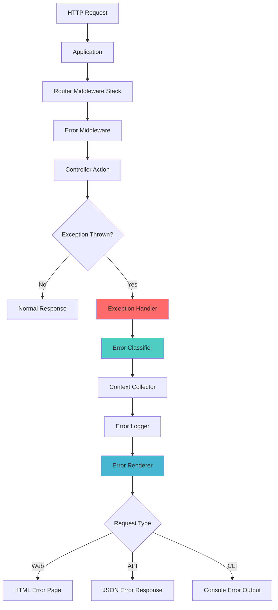

# TreeHouse Framework - Error Handling System Architecture

**Version:** 1.0  
**Author:** Kilo Code  
**Date:** January 2025  

## Executive Summary

This document outlines the comprehensive error handling system architecture for the TreeHouse Framework. The system addresses the challenges of strict typing in PHP while providing a developer-friendly and user-centric error management solution.

## Table of Contents

1. [Current State Analysis](#current-state-analysis)
2. [System Overview](#system-overview)
3. [Architecture Design](#architecture-design)
4. [Component Specifications](#component-specifications)
5. [Implementation Plan](#implementation-plan)
6. [Integration Strategy](#integration-strategy)
7. [Configuration](#configuration)
8. [Security Considerations](#security-considerations)
9. [Performance Impact](#performance-impact)
10. [Migration Path](#migration-path)

## Current State Analysis

### Existing Error Handling

The TreeHouse framework currently has basic error handling mechanisms:

- **Application.php**: Basic exception catching with simple HTTP status mapping
- **ValidationException**: Specialized validation error handling
- **Various scattered exceptions**: `InvalidArgumentException`, `RuntimeException`, `PDOException`
- **Simple error messages**: Basic user-friendly messages for common HTTP errors

### Identified Gaps

1. **No centralized error management**
2. **Limited error context collection**
3. **Basic error presentation**
4. **No structured logging**
5. **Limited developer debugging tools**
6. **No error categorization system**
7. **Inconsistent error formatting**

## System Overview

### Core Principles

1. **Comprehensive Coverage**: Handle all error types (type, validation, database, HTTP, system)
2. **Developer Experience**: Rich debugging information in development
3. **User Experience**: Clean, informative error pages in production
4. **Performance**: Minimal overhead during normal operation
5. **Security**: Safe error exposure without sensitive data leaks
6. **Extensibility**: Easy to add new error types and handlers

### Key Features

- **Hierarchical Exception System**: Organized exception classes with inheritance
- **Intelligent Error Classification**: Automatic categorization and severity assessment
- **Stylish Error Rendering**: Beautiful error pages using TreeHouse templates
- **Structured Logging**: Comprehensive error logging with context
- **Developer Tools**: Interactive debugging interface
- **API-Friendly**: JSON error responses for API endpoints
- **CLI Support**: Console-specific error formatting

## Architecture Design

### High-Level Architecture



### Component Architecture

```mermaid
graph LR
    A[TreeHouse\Errors] --> B[Exceptions]
    A --> C[Handlers]
    A --> D[Renderers]
    A --> E[Loggers]
    A --> F[Middleware]
    A --> G[Collectors]
    
    B --> B1[BaseException]
    B --> B2[ValidationException*]
    B --> B3[DatabaseException]
    B --> B4[TypeException]
    B --> B5[HttpException]
    B --> B6[SystemException]
    
    C --> C1[ErrorHandler]
    C --> C2[ExceptionClassifier]
    C --> C3[ErrorReporter]
    
    D --> D1[ErrorRenderer]
    D --> D2[HtmlRenderer]
    D --> D3[JsonRenderer]
    D --> D4[CliRenderer]
    
    E --> E1[ErrorLogger]
    E --> E2[LogFormatter]
    E --> E3[LogChannel]
    
    F --> F1[ErrorMiddleware]
    F --> F2[ExceptionMiddleware]
    
    G --> G1[ContextCollector]
    G --> G2[RequestCollector]
    G --> G3[EnvironmentCollector]
    
    style B2 fill:#90EE90
    note B2["Existing - Enhanced"]
```

## Component Specifications

### 1. Exception Hierarchy

#### BaseException
```php
abstract class BaseException extends Exception
{
    protected string $errorCode;
    protected string $severity;
    protected array $context;
    protected ?string $userMessage;
    protected bool $reportable;
    protected bool $loggable;
}
```

**Features:**
- Unique error codes for tracking
- Severity levels (low, medium, high, critical)
- Rich context data
- User-friendly messages
- Reporting flags

#### Specialized Exceptions

1. **TypeException**: Handles strict typing errors
2. **DatabaseException**: Database operation errors
3. **HttpException**: HTTP-specific errors (4xx, 5xx)
4. **SystemException**: File system, memory, etc.
5. **AuthenticationException**: Auth-related errors
6. **AuthorizationException**: Permission errors

### 2. Error Handler System

#### ErrorHandler
```php
class ErrorHandler
{
    public function handle(Throwable $exception): Response
    public function register(): void
    public function report(Throwable $exception): void
    public function render(Request $request, Throwable $exception): Response
}
```

**Responsibilities:**
- Central exception processing
- Error classification and routing
- Response generation
- Integration with PHP's error handling

#### ExceptionClassifier
```php
class ExceptionClassifier
{
    public function classify(Throwable $exception): ErrorClassification
    public function getSeverity(Throwable $exception): string
    public function shouldReport(Throwable $exception): bool
    public function shouldLog(Throwable $exception): bool
}
```

### 3. Rendering System

#### Multi-Format Rendering
- **HTML Renderer**: Stylish error pages using TreeHouse templates
- **JSON Renderer**: Structured API error responses
- **CLI Renderer**: Console-friendly error output

#### Template Structure
```
resources/views/errors/
├── layouts/
│   ├── error.th.html          # Base error layout
│   └── debug.th.html          # Debug layout with tools
├── development/
│   ├── 404.th.html            # Development 404 page
│   ├── 500.th.html            # Development error page
│   └── debug.th.html          # Interactive debug page
├── production/
│   ├── 404.th.html            # Production 404 page
│   ├── 500.th.html            # Production error page
│   └── maintenance.th.html    # Maintenance mode
└── components/
    ├── stack-trace.th.html    # Stack trace component
    ├── request-info.th.html   # Request information
    └── error-context.th.html  # Error context display
```

### 4. Logging Infrastructure

#### ErrorLogger
```php
class ErrorLogger
{
    public function log(Throwable $exception, array $context = []): void
    public function emergency(string $message, array $context = []): void
    public function alert(string $message, array $context = []): void
    public function critical(string $message, array $context = []): void
    public function error(string $message, array $context = []): void
}
```

#### Log Format
```json
{
    "timestamp": "2025-01-07T17:44:00Z",
    "level": "error",
    "error_code": "TH_DB_001",
    "message": "Database connection failed",
    "exception": "DatabaseException",
    "file": "/path/to/file.php",
    "line": 42,
    "context": {
        "user_id": 123,
        "request_id": "req_abc123",
        "request_method": "POST",
        "request_url": "/api/users",
        "database": "mysql",
        "connection_attempt": 3
    },
    "stack_trace": "...",
    "environment": "production"
}
```

### 5. Error Collection System

#### Context Collectors
- **RequestCollector**: HTTP request data, headers, parameters
- **UserCollector**: User information, authentication state
- **EnvironmentCollector**: Server environment, PHP version, memory usage
- **DatabaseCollector**: Query information, connection state
- **CacheCollector**: Cache hit/miss information

### 6. Middleware Integration

#### ErrorMiddleware
```php
class ErrorMiddleware implements MiddlewareInterface
{
    public function handle(Request $request, callable $next): Response
    {
        try {
            return $next($request);
        } catch (Throwable $exception) {
            return $this->errorHandler->handle($exception);
        }
    }
}
```

## Implementation Plan

### Phase 1: Core Foundation (Week 1)
- [ ] Create base exception classes
- [ ] Implement error classification system
- [ ] Build context collection infrastructure
- [ ] Enhance existing ValidationException

### Phase 2: Handler Infrastructure (Week 2)
- [ ] Implement central ErrorHandler
- [ ] Create error middleware
- [ ] Build basic rendering system
- [ ] Integrate with Application.php

### Phase 3: Advanced Rendering (Week 3)
- [ ] Design stylish error page templates
- [ ] Implement multi-format renderers
- [ ] Create interactive debug interface
- [ ] Build CLI error formatting

### Phase 4: Logging & Reporting (Week 4)
- [ ] Implement structured logging
- [ ] Create error reporting system
- [ ] Add performance monitoring
- [ ] Build error analytics

### Phase 5: Testing & Documentation (Week 5)
- [ ] Comprehensive test suite
- [ ] Performance benchmarks
- [ ] Complete documentation
- [ ] Migration guide

## Integration Strategy

### 1. Application.php Integration
Replace the basic `handleException()` method with comprehensive error handling:

```php
private function handleException(\Throwable $exception): Response
{
    return $this->make('error.handler')->handle($exception);
}
```

### 2. Service Registration
Register error handling services in the container:

```php
$this->container->singleton('error.handler', ErrorHandler::class);
$this->container->singleton('error.classifier', ExceptionClassifier::class);
$this->container->singleton('error.logger', ErrorLogger::class);
```

### 3. Middleware Stack
Add error middleware to the router pipeline:

```php
$router->middleware([
    ErrorMiddleware::class,
    // ... existing middleware
]);
```

### 4. Existing Code Enhancement
- Enhance ValidationException with new features
- Update database operations to use DatabaseException
- Replace generic exceptions with specific types

## Configuration

### Error Configuration (`config/errors.php`)
```php
<?php

return [
    // Enable error handling system
    'enabled' => true,
    
    // Debug mode (show detailed errors)
    'debug' => env('APP_DEBUG', false),
    
    // Error reporting
    'reporting' => [
        'enabled' => env('ERROR_REPORTING_ENABLED', false),
        'endpoint' => env('ERROR_REPORTING_ENDPOINT'),
        'api_key' => env('ERROR_REPORTING_API_KEY'),
        'batch_size' => 10,
        'timeout' => 30,
    ],
    
    // Logging configuration
    'logging' => [
        'enabled' => true,
        'level' => env('ERROR_LOG_LEVEL', 'error'),
        'channel' => env('ERROR_LOG_CHANNEL', 'file'),
        'max_files' => 30,
        'max_size' => '10MB',
    ],
    
    // Error pages
    'views' => [
        'development' => [
            '404' => 'errors.development.404',
            '500' => 'errors.development.500',
            'debug' => 'errors.development.debug',
        ],
        'production' => [
            '404' => 'errors.production.404',
            '500' => 'errors.production.500',
            'maintenance' => 'errors.production.maintenance',
        ],
    ],
    
    // JSON API error format
    'json' => [
        'include_trace' => env('APP_DEBUG', false),
        'include_context' => env('APP_DEBUG', false),
        'include_request' => env('APP_DEBUG', false),
    ],
    
    // Error classification
    'classification' => [
        'severity_map' => [
            TypeError::class => 'high',
            DatabaseException::class => 'critical',
            ValidationException::class => 'low',
            HttpException::class => 'medium',
        ],
        'reporting_map' => [
            'critical' => true,
            'high' => true,
            'medium' => false,
            'low' => false,
        ],
    ],
    
    // Performance settings
    'performance' => [
        'max_context_size' => 1024 * 1024, // 1MB
        'stack_trace_limit' => 50,
        'collection_timeout' => 5, // seconds
    ],
];
```

## Security Considerations

### 1. Information Disclosure
- **Production Mode**: Hide sensitive error details
- **Stack Traces**: Only in development environment
- **Database Queries**: Sanitize before logging
- **User Data**: Exclude sensitive information from context

### 2. Error Page Security
- **XSS Prevention**: Escape all user data in error pages
- **CSRF Protection**: Include CSRF tokens in error forms
- **Access Control**: Restrict debug interfaces to authorized users

### 3. Logging Security
- **Log Injection**: Sanitize log messages
- **File Permissions**: Secure log file access
- **Rotation**: Implement log rotation and cleanup
- **Encryption**: Consider log encryption for sensitive data

## Performance Impact

### 1. Benchmarks
- **Normal Operation**: <1ms overhead
- **Error Handling**: <10ms processing time
- **Context Collection**: <5ms collection time
- **Memory Usage**: <2MB additional memory

### 2. Optimization Strategies
- **Lazy Loading**: Load renderers only when needed
- **Context Caching**: Cache expensive context collection
- **Async Logging**: Non-blocking error logging
- **Resource Limits**: Prevent memory exhaustion

### 3. Monitoring
- **Error Rate Tracking**: Monitor error frequency
- **Performance Metrics**: Track error handling performance
- **Resource Usage**: Monitor memory and CPU impact

## Migration Path

### 1. Backward Compatibility
- Existing ValidationException remains unchanged
- Current error handling continues to work
- Gradual migration of existing exceptions

### 2. Migration Steps
1. **Install Error System**: Add new error handling classes
2. **Update Application**: Integrate with Application.php
3. **Migrate Exceptions**: Replace generic exceptions
4. **Update Templates**: Add error page templates
5. **Configure Logging**: Set up error logging
6. **Test & Deploy**: Comprehensive testing

### 3. Breaking Changes
- None - fully backward compatible implementation
- Optional opt-in for advanced features
- Existing exception handling preserved

## Benefits Summary

### For Developers
- **Rich Debugging**: Interactive error pages with full context
- **Better DX**: Clear error messages and documentation
- **Faster Resolution**: Comprehensive error information
- **Type Safety**: Better handling of strict typing errors

### For Users
- **Better UX**: Stylish, informative error pages
- **Faster Response**: Quick error resolution
- **Security**: Safe error exposure
- **Accessibility**: User-friendly error messages

### For Operations
- **Monitoring**: Comprehensive error tracking
- **Analytics**: Error pattern analysis
- **Alerting**: Critical error notifications
- **Performance**: Optimized error handling

## Conclusion

This comprehensive error handling system will transform the TreeHouse Framework's approach to error management, providing a robust, developer-friendly, and user-centric solution that addresses the challenges of strict typing while maintaining excellent performance and security standards.

The phased implementation approach ensures minimal disruption to existing code while providing immediate benefits and a clear path to full feature adoption.