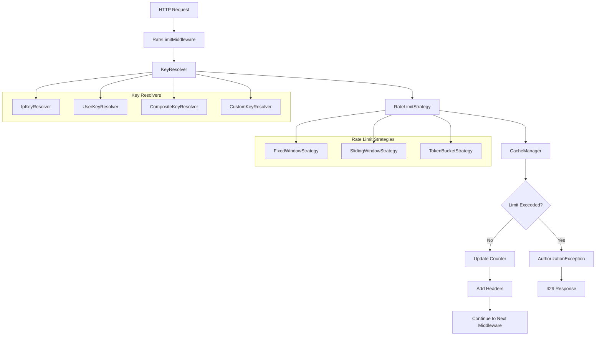

# API Rate Limiting Middleware Implementation Plan

## Overview

This document outlines the implementation plan for API Rate Limiting Middleware in TreeHouse Framework. The design maximally reuses existing components while providing a flexible, multi-strategy rate limiting system.

## Existing Components We Can Reuse

### 1. Cache System
- **`CacheManager`** (`src/TreeHouse/Cache/CacheManager.php`) - Provides increment/decrement operations
- **`FileCache`** (`src/TreeHouse/Cache/FileCache.php`) - File-based storage with TTL support
- **Benefits**: Perfect for storing rate limit counters, aligns with zero-dependency philosophy

### 2. Middleware Infrastructure
- **`MiddlewareInterface`** (`src/TreeHouse/Router/Middleware/MiddlewareInterface.php`) - Standard middleware contract
- **`MiddlewareStack`** (`src/TreeHouse/Router/Middleware/MiddlewareStack.php`) - Parameter parsing and execution
- **Benefits**: Established pattern for request processing

### 3. Exception System
- **`AuthorizationException::rateLimitExceeded()`** (`src/TreeHouse/Errors/Exceptions/AuthorizationException.php:302`) - Pre-built rate limit exception
- **Benefits**: 429 status code, proper error context, integration with error handling

### 4. HTTP Components
- **`Request`** (`src/TreeHouse/Http/Request.php`) - Request analysis (IP, headers, user)
- **`Response`** (`src/TreeHouse/Http/Response.php`) - Response generation with headers
- **Benefits**: Complete HTTP handling capabilities

## Architecture Design



## Component Structure

### Core Components
1. **`RateLimitMiddleware`** - Main middleware implementing `MiddlewareInterface`
2. **`RateLimitManager`** - Orchestrates strategy and key resolution
3. **`RateLimitConfig`** - Configuration parsing and validation
4. **`RateLimitResult`** - Encapsulates rate limit check results
5. **`RateLimitHeaders`** - Manages HTTP headers (X-RateLimit-*)

### Rate Limiting Strategies
1. **`RateLimitStrategyInterface`** - Contract for all strategies
2. **`FixedWindowStrategy`** - Simple time-based windows
3. **`SlidingWindowStrategy`** - Rolling time windows
4. **`TokenBucketStrategy`** - Burst-friendly rate limiting

### Key Resolution System
1. **`KeyResolverInterface`** - Contract for key generation
2. **`IpKeyResolver`** - IP-based identification
3. **`UserKeyResolver`** - User ID-based identification
4. **`CompositeKeyResolver`** - Combines multiple resolvers
5. **`CustomKeyResolver`** - Flexible custom key generation

## Configuration Syntax

### Route-Based Configuration
```php
// Basic usage
Route::get('/api/users', [UserController::class, 'index'])
    ->middleware('throttle:60,1'); // 60 requests per 1 minute

// Advanced configuration
Route::post('/api/upload', [FileController::class, 'upload'])
    ->middleware('throttle:10,1,sliding,user'); // 10 req/min, sliding window, user-based

// Multiple limits
Route::get('/api/search', [SearchController::class, 'search'])
    ->middleware('throttle:100,1|1000,60'); // 100/min OR 1000/hour

// Custom key resolver
Route::post('/api/webhook', [WebhookController::class, 'handle'])
    ->middleware('throttle:50,1,fixed,header:x-api-key'); // Based on API key header
```

### Parameter Format
- **Format**: `throttle:limit,window[,strategy][,key_resolver]`
- **limit**: Number of requests allowed
- **window**: Time window in minutes
- **strategy**: `fixed` (default), `sliding`, `token_bucket`
- **key_resolver**: `ip` (default), `user`, `ip+user`, `header:name`, `custom:class`

## File Structure

```
src/TreeHouse/Router/Middleware/RateLimit/
├── RateLimitMiddleware.php
├── RateLimitManager.php
├── RateLimitConfig.php
├── RateLimitResult.php
├── RateLimitHeaders.php
├── Strategies/
│   ├── RateLimitStrategyInterface.php
│   ├── FixedWindowStrategy.php
│   ├── SlidingWindowStrategy.php
│   └── TokenBucketStrategy.php
└── KeyResolvers/
    ├── KeyResolverInterface.php
    ├── IpKeyResolver.php
    ├── UserKeyResolver.php
    ├── CompositeKeyResolver.php
    └── CustomKeyResolver.php
```

## Implementation Details

### Cache Integration
- Use existing `CacheManager` with `increment()`/`decrement()` operations
- Cache key format: `rate_limit:{strategy}:{key}:{window}`
- TTL management for automatic cleanup
- Prefix support for isolation

### Error Handling
- Use existing `AuthorizationException::rateLimitExceeded()`
- Proper 429 status codes with Retry-After headers
- JSON/HTML response formatting via existing error system
- Context includes limit details and retry information

### HTTP Headers
Standard rate limiting headers:
- `X-RateLimit-Limit`: Request limit per window
- `X-RateLimit-Remaining`: Remaining requests in current window
- `X-RateLimit-Reset`: Unix timestamp when window resets
- `Retry-After`: Seconds to wait before retrying (when limited)

### Key Resolution Examples
```php
// IP-based (default)
'throttle:60,1' // Uses client IP address

// User-based
'throttle:60,1,fixed,user' // Uses authenticated user ID

// Composite
'throttle:60,1,fixed,ip+user' // Combines IP and user ID

// Header-based
'throttle:60,1,fixed,header:x-api-key' // Uses custom header value

// Custom resolver
'throttle:60,1,fixed,custom:App\\RateLimit\\TenantKeyResolver'
```

## Implementation Phases

### Phase 1: Core Infrastructure
- [ ] `RateLimitMiddleware` with basic functionality
- [ ] `RateLimitManager` orchestration
- [ ] `RateLimitConfig` parameter parsing
- [ ] `FixedWindowStrategy` implementation
- [ ] `IpKeyResolver` implementation
- [ ] Integration with existing cache and exception systems

### Phase 2: Enhanced Key Resolution
- [ ] `UserKeyResolver` for authenticated users
- [ ] `CompositeKeyResolver` for combined keys
- [ ] `CustomKeyResolver` for flexible key generation
- [ ] Header-based key resolution

### Phase 3: Advanced Strategies
- [ ] `SlidingWindowStrategy` implementation
- [ ] `TokenBucketStrategy` implementation
- [ ] Strategy selection and configuration

### Phase 4: Advanced Features
- [ ] Multiple limit support (e.g., 100/min AND 1000/hour)
- [ ] Rate limit monitoring and metrics
- [ ] Configuration file support
- [ ] Performance optimizations

## Testing Strategy

### Unit Tests
- [ ] Each strategy implementation
- [ ] Each key resolver implementation
- [ ] Configuration parsing
- [ ] Cache integration

### Integration Tests
- [ ] Middleware stack integration
- [ ] Request/response flow
- [ ] Error handling
- [ ] Header generation

### Performance Tests
- [ ] Cache operation efficiency
- [ ] Concurrent request handling
- [ ] Memory usage optimization
- [ ] Large-scale rate limiting

## Benefits

1. **Maximum Reuse**: Leverages existing cache, middleware, and exception systems
2. **Zero Dependencies**: Uses only existing TreeHouse components
3. **Multiple Strategies**: Supports different rate limiting algorithms
4. **Flexible Key Resolution**: Custom key generation based on various request attributes
5. **Route-Based Configuration**: Simple and familiar configuration pattern
6. **Framework Integration**: Follows TreeHouse patterns and conventions
7. **Performance Optimized**: Efficient cache operations with minimal overhead

## Configuration Integration

### Rate Limiting Configuration File
```php
// config/rate_limiting.php
return [
    'enabled' => env('RATE_LIMITING_ENABLED', true),
    'default_strategy' => env('RATE_LIMITING_STRATEGY', 'fixed'),
    'default_key_resolver' => env('RATE_LIMITING_KEY_RESOLVER', 'ip'),
    'cache_store' => env('RATE_LIMITING_CACHE_STORE', 'default'),
    'cache_prefix' => 'rate_limit',
    
    'strategies' => [
        'fixed' => [
            'class' => FixedWindowStrategy::class,
        ],
        'sliding' => [
            'class' => SlidingWindowStrategy::class,
            'precision' => 60, // seconds
        ],
        'token_bucket' => [
            'class' => TokenBucketStrategy::class,
            'refill_rate' => 1, // tokens per second
        ],
    ],
    
    'key_resolvers' => [
        'ip' => IpKeyResolver::class,
        'user' => UserKeyResolver::class,
        'composite' => CompositeKeyResolver::class,
        'custom' => CustomKeyResolver::class,
    ],
    
    'headers' => [
        'limit' => 'X-RateLimit-Limit',
        'remaining' => 'X-RateLimit-Remaining',
        'reset' => 'X-RateLimit-Reset',
        'retry_after' => 'Retry-After',
    ],
];
```

This implementation plan provides a comprehensive, flexible rate limiting system that integrates seamlessly with TreeHouse's existing architecture while maintaining the framework's zero-dependency philosophy.