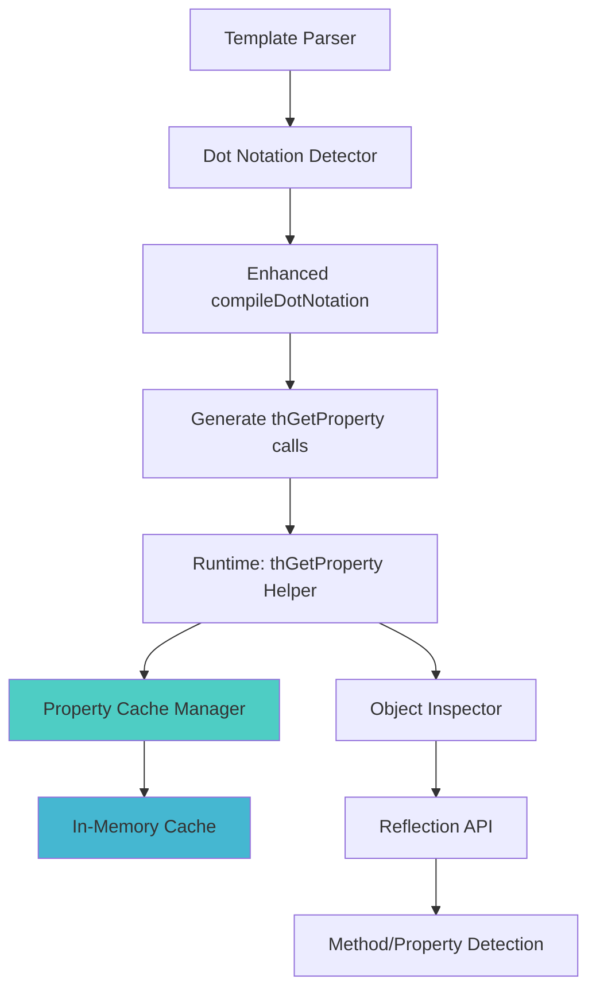

# TreeHouse Template Compiler - Enhanced Object Support Plan

**Version:** 1.0  
**Author:** Kilo Code  
**Date:** January 2025  

## Overview

This document outlines the enhancement of the TreeHouse template compiler to support object property and method access with dot notation, while maintaining backward compatibility with array access. The solution includes performance optimization through reflection caching.

## Current State

### Existing Behavior
```php
// Template: user.name
// Compiled: $user['name']  // Only array access
```

### Limitations
- Only supports array access with bracket notation
- Cannot access object properties or methods
- No support for deep object chains
- Collection objects from database queries not supported

## Enhanced Solution

### Template Syntax (Clean - No Parentheses)
```html
<!-- Object property access -->
<div th:text="user.name">Name</div>

<!-- Method access (no parentheses in template) -->
<div th:text="user.getName">Name</div>
<div th:text="user.isActive">Status</div>

<!-- Deep property chains -->
<div th:text="user.profile.settings.theme">Theme</div>

<!-- Collection access -->
<div th:text="users.first.email">First User Email</div>

<!-- Mixed object/array access -->
<div th:text="config.database.host">DB Host</div>
```

### Generated PHP
```php
// user.name → thGetProperty($user, 'name')
// user.profile.email → thGetProperty(thGetProperty($user, 'profile'), 'email')
```

## Architecture Design

### Component Overview



### Core Components

#### 1. Enhanced Property Access Helper
**Location:** `src/TreeHouse/View/helpers.php`

```php
function thGetProperty($target, string $property, bool $useCache = true)
{
    // Use cached property access information for performance
    static $cache = [];
    
    if ($target === null) {
        return null;
    }
    
    // Generate cache key based on object class and property
    $cacheKey = null;
    if ($useCache && is_object($target)) {
        $cacheKey = get_class($target) . '::' . $property;
        if (isset($cache[$cacheKey])) {
            return $cache[$cacheKey]['accessor']($target);
        }
    }
    
    $accessor = thResolvePropertyAccess($target, $property);
    
    // Cache the accessor for future use
    if ($useCache && $cacheKey && $accessor) {
        $cache[$cacheKey] = ['accessor' => $accessor];
    }
    
    return $accessor ? $accessor($target) : null;
}
```

#### 2. Property Access Resolver
```php
function thResolvePropertyAccess($target, string $property): ?callable
{
    if (is_object($target)) {
        return thResolveObjectAccess($target, $property);
    }
    
    if (is_array($target)) {
        return thResolveArrayAccess($target, $property);
    }
    
    return null;
}
```

#### 3. Object Access Resolver (with Caching)
```php
function thResolveObjectAccess(object $target, string $property): ?callable
{
    $class = get_class($target);
    
    // Check property access patterns in order of preference
    $accessors = [
        // 1. Direct property access
        fn($obj) => property_exists($obj, $property) ? $obj->$property : null,
        
        // 2. Direct method call (user.getName → $user->getName())
        fn($obj) => method_exists($obj, $property) ? $obj->$property() : null,
        
        // 3. Getter method (user.name → $user->getName())
        fn($obj) => method_exists($obj, 'get' . ucfirst($property)) ? $obj->{'get' . ucfirst($property)}() : null,
        
        // 4. Is/Has boolean methods (user.active → $user->isActive())
        fn($obj) => method_exists($obj, 'is' . ucfirst($property)) ? $obj->{'is' . ucfirst($property)}() : null,
        fn($obj) => method_exists($obj, 'has' . ucfirst($property)) ? $obj->{'has' . ucfirst($property)}() : null,
        
        // 5. Snake_case to camelCase conversion (user.first_name → $user->getFirstName())
        fn($obj) => method_exists($obj, 'get' . str_replace(' ', '', ucwords(str_replace('_', ' ', $property)))) 
                    ? $obj->{'get' . str_replace(' ', '', ucwords(str_replace('_', ' ', $property)))}() : null,
    ];
    
    foreach ($accessors as $accessor) {
        try {
            $result = $accessor($target);
            if ($result !== null) {
                return $accessor;
            }
        } catch (Throwable $e) {
            // Continue to next accessor
            continue;
        }
    }
    
    return null;
}
```

#### 4. Enhanced Compiler Method
**Location:** `src/TreeHouse/View/Compilers/TreeHouseCompiler.php`

```php
protected function compileDotNotation(string $expression): string
{
    return preg_replace_callback(
        '/\$?([a-zA-Z_]\w*)\.([a-zA-Z_]\w*(?:\.[a-zA-Z_]\w*)*)\b/',
        function($matches) {
            $var = $matches[1];
            $path = $matches[2];
            $keys = explode('.', $path);
            
            // Build nested thGetProperty calls
            $result = '$' . $var;
            foreach ($keys as $key) {
                $result = "thGetProperty({$result}, '{$key}')";
            }
            
            return $result;
        },
        $expression
    );
}
```

## Performance Optimization Strategy

### 1. Multi-Level Caching

#### Static Cache (In-Memory)
```php
class PropertyAccessCache
{
    private static array $cache = [];
    private static int $maxCacheSize = 1000;
    
    public static function get(string $class, string $property): ?callable
    {
        $key = "{$class}::{$property}";
        return self::$cache[$key] ?? null;
    }
    
    public static function set(string $class, string $property, callable $accessor): void
    {
        $key = "{$class}::{$property}";
        
        // Implement LRU cache eviction
        if (count(self::$cache) >= self::$maxCacheSize) {
            array_shift(self::$cache);
        }
        
        self::$cache[$key] = $accessor;
    }
}
```

#### APCu Cache (Shared Memory)
```php
function thGetCachedPropertyAccess(string $class, string $property): ?array
{
    if (function_exists('apcu_fetch')) {
        $key = "th_prop:{$class}:{$property}";
        $cached = apcu_fetch($key);
        return $cached !== false ? $cached : null;
    }
    return null;
}

function thSetCachedPropertyAccess(string $class, string $property, array $metadata): void
{
    if (function_exists('apcu_store')) {
        $key = "th_prop:{$class}:{$property}";
        apcu_store($key, $metadata, 3600); // 1 hour TTL
    }
}
```

### 2. Reflection Optimization

#### Batch Reflection Analysis
```php
class ReflectionCache
{
    private static array $classInfo = [];
    
    public static function analyzeClass(string $class): array
    {
        if (isset(self::$classInfo[$class])) {
            return self::$classInfo[$class];
        }
        
        $reflection = new ReflectionClass($class);
        $info = [
            'properties' => [],
            'methods' => [],
            'getters' => [],
            'boolean_methods' => [],
        ];
        
        // Analyze properties
        foreach ($reflection->getProperties(ReflectionProperty::IS_PUBLIC) as $prop) {
            $info['properties'][$prop->getName()] = true;
        }
        
        // Analyze methods
        foreach ($reflection->getMethods(ReflectionMethod::IS_PUBLIC) as $method) {
            $name = $method->getName();
            $info['methods'][$name] = true;
            
            // Categorize special methods
            if (str_starts_with($name, 'get')) {
                $property = lcfirst(substr($name, 3));
                $info['getters'][$property] = $name;
            } elseif (str_starts_with($name, 'is') || str_starts_with($name, 'has')) {
                $prefix = str_starts_with($name, 'is') ? 'is' : 'has';
                $property = lcfirst(substr($name, strlen($prefix)));
                $info['boolean_methods'][$property] = $name;
            }
        }
        
        self::$classInfo[$class] = $info;
        return $info;
    }
}
```

### 3. Performance Benchmarks

#### Target Performance
- **Cold Cache**: < 5ms for property resolution
- **Warm Cache**: < 0.1ms for cached property access
- **Memory Usage**: < 10MB for 1000 cached class/property combinations
- **Cache Hit Rate**: > 95% for repeated template renders

#### Monitoring
```php
class PropertyAccessMetrics
{
    private static array $metrics = [
        'cache_hits' => 0,
        'cache_misses' => 0,
        'reflection_calls' => 0,
        'total_calls' => 0,
    ];
    
    public static function recordCacheHit(): void
    {
        self::$metrics['cache_hits']++;
        self::$metrics['total_calls']++;
    }
    
    public static function getStats(): array
    {
        $total = self::$metrics['total_calls'];
        return [
            'cache_hit_rate' => $total > 0 ? (self::$metrics['cache_hits'] / $total) * 100 : 0,
            'total_calls' => $total,
            'reflection_calls' => self::$metrics['reflection_calls'],
        ];
    }
}
```

## Implementation Plan

### Phase 1: Core Helper Functions (Week 1)
- [ ] Create `thGetProperty()` helper function
- [ ] Implement basic object/array detection
- [ ] Add property access resolution
- [ ] Create basic caching mechanism

### Phase 2: Enhanced Compiler (Week 1)
- [ ] Update `compileDotNotation()` method
- [ ] Handle deep property chains
- [ ] Test with existing templates
- [ ] Ensure backward compatibility

### Phase 3: Performance Optimization (Week 2)
- [ ] Implement reflection caching
- [ ] Add APCu cache support
- [ ] Create performance monitoring
- [ ] Optimize cache eviction strategies

### Phase 4: Advanced Features (Week 2)
- [ ] Add snake_case to camelCase conversion
- [ ] Support for magic methods (`__get`, `__call`)
- [ ] Error handling and debugging
- [ ] Performance benchmarking

### Phase 5: Testing & Documentation (Week 3)
- [ ] Comprehensive test suite
- [ ] Performance benchmarks
- [ ] Documentation updates
- [ ] Migration guide

## Error Handling

### Graceful Degradation
```php
function thGetProperty($target, string $property): mixed
{
    try {
        return thGetPropertyInternal($target, $property);
    } catch (Throwable $e) {
        // Log error for debugging
        if (function_exists('error_log')) {
            error_log("TreeHouse Template Error: Failed to access property '{$property}' on " . gettype($target) . ": " . $e->getMessage());
        }
        
        // Return null to prevent template crashes
        return null;
    }
}
```

### Debug Mode
```php
function thGetPropertyWithDebug($target, string $property): mixed
{
    if (defined('TH_DEBUG') && TH_DEBUG) {
        $startTime = microtime(true);
        $result = thGetProperty($target, $property);
        $duration = microtime(true) - $startTime;
        
        echo "<!-- Property Access: " . gettype($target) . ".{$property} took {$duration}ms -->\n";
        return $result;
    }
    
    return thGetProperty($target, $property);
}
```

## Backward Compatibility

### Migration Strategy
1. **Existing templates continue working** - array access unchanged
2. **Gradual adoption** - can mix old and new syntax
3. **Performance impact** - minimal for existing array-based templates
4. **Fallback mechanism** - object access falls back to array access

### Example Migration
```html
<!-- Before (still works) -->
<div th:text="${user['name']}">Name</div>

<!-- After (enhanced) -->
<div th:text="user.name">Name</div>

<!-- Both work simultaneously -->
<div th:text="config.database.host">Host</div>  <!-- Array access -->
<div th:text="user.profile.email">Email</div>   <!-- Object access -->
```

## Security Considerations

### Access Control
```php
function thIsPropertyAccessible(object $target, string $property): bool
{
    // Check for private/protected properties
    $reflection = new ReflectionClass($target);
    
    if ($reflection->hasProperty($property)) {
        $prop = $reflection->getProperty($property);
        return $prop->isPublic();
    }
    
    // Check for public methods
    if ($reflection->hasMethod($property)) {
        $method = $reflection->getMethod($property);
        return $method->isPublic();
    }
    
    return false;
}
```

### Sensitive Data Protection
```php
function thGetProperty($target, string $property): mixed
{
    // Blacklist sensitive properties
    $sensitiveProperties = ['password', 'token', 'secret', 'key'];
    
    if (in_array(strtolower($property), $sensitiveProperties)) {
        return '***HIDDEN***';
    }
    
    return thGetPropertyInternal($target, $property);
}
```

## Benefits Summary

### For Developers
- **Clean Template Syntax**: No parentheses or complex syntax
- **Object Support**: ActiveRecord models work seamlessly
- **Performance**: Cached reflection calls for speed
- **Backward Compatible**: Existing templates continue working

### For Users
- **Better Performance**: Cached property access
- **Rich Data Access**: Deep object property chains
- **Reliability**: Graceful error handling

### For Framework
- **Modern Templates**: Support for object-oriented data
- **Performance**: Optimized reflection caching
- **Extensibility**: Easy to add new access patterns
- **Maintainability**: Clean, well-documented code

This enhanced template compiler will significantly improve the developer experience while maintaining excellent performance through intelligent caching strategies.