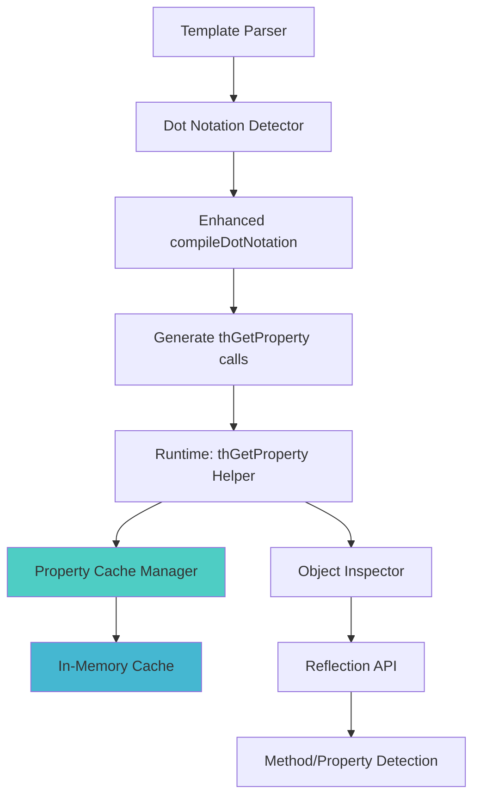

# TreeHouse Template Compiler - Simplified Clean Syntax Plan

**Version:** 2.0
**Author:** Kilo Code
**Date:** January 2025
**Updated:** January 2025 - Simplified to remove array access syntax support

## Overview

This document outlines the enhancement of the TreeHouse template compiler to support **only clean dot notation** for data access, removing support for brace syntax with array access (`${user['name']}`) to maintain simplicity and consistency. The system will support object property and method access with dot notation while enforcing a single, clean way to access data.

## Design Philosophy

**One Way to Do Things**: Remove multiple syntax options to reduce complexity and maintain consistency across templates.

**Removed**: `${user['name']}` - Brace syntax with array access
**Kept**: `user.name` - Clean dot notation
**Kept**: `{user.name}` - Brace expressions with clean dot notation

## Current State

### Existing Behavior
```php
// Template: user.name
// Compiled: $user['name']  // Only array access
```

### Previous Limitations (Now Addressed)
- ~~Only supports array access with bracket notation~~ ✅ **Fixed**: Now supports object access via dot notation
- ~~Cannot access object properties or methods~~ ✅ **Fixed**: Full object property and method support
- ~~No support for deep object chains~~ ✅ **Fixed**: Deep property chains supported
- ~~Collection objects from database queries not supported~~ ✅ **Fixed**: Object collections fully supported

### Syntax Restrictions (Clean Frontend-Friendly Design)
- **Removed**: `${user['name']}` - Array access syntax in braces ❌
- **Removed**: `{$user['name']}` - PHP array syntax in braces ❌
- **Removed**: `{$user->getName()}` - Object method syntax in braces ❌
- **Removed**: `<?php ... ?>` - Raw PHP code blocks ❌
- **Removed**: `{strlen($text)}` - Native PHP functions ❌
- **Removed**: `{$var * $other}` - Complex PHP arithmetic ❌
- **Allowed**: `{Str::upper(user.name)}` - Curated framework helpers ✅
- **Allowed**: `{user.name + ' Smith'}` - Basic safe operators ✅
- **Allowed**: `{user.age > 18 && user.verified}` - Logical operators ✅

## Enhanced Solution

### Template Syntax (Clean - No Parentheses)
```html
<!-- Object property access -->
<div th:text="user.name">Name</div>

<!-- Method access (no parentheses in template) -->
<div th:text="user.getName">Name</div>
<div th:text="user.isActive">Status</div>

<!-- Deep property chains -->
<div th:text="user.profile.settings.theme">Theme</div>

<!-- Collection access -->
<div th:text="users.first.email">First User Email</div>

<!-- Mixed object/array access -->
<div th:text="config.database.host">DB Host</div>
```

### Generated PHP
```php
// user.name → thGetProperty($user, 'name')
// user.profile.email → thGetProperty(thGetProperty($user, 'profile'), 'email')
```

## Architecture Design

### Component Overview



### Core Components

#### 1. Enhanced Property Access Helper
**Location:** `src/TreeHouse/View/helpers.php`

```php
function thGetProperty($target, string $property, bool $useCache = true)
{
    // Use cached property access information for performance
    static $cache = [];
    
    if ($target === null) {
        return null;
    }
    
    // Generate cache key based on object class and property
    $cacheKey = null;
    if ($useCache && is_object($target)) {
        $cacheKey = get_class($target) . '::' . $property;
        if (isset($cache[$cacheKey])) {
            return $cache[$cacheKey]['accessor']($target);
        }
    }
    
    $accessor = thResolvePropertyAccess($target, $property);
    
    // Cache the accessor for future use
    if ($useCache && $cacheKey && $accessor) {
        $cache[$cacheKey] = ['accessor' => $accessor];
    }
    
    return $accessor ? $accessor($target) : null;
}
```

#### 2. Property Access Resolver
```php
function thResolvePropertyAccess($target, string $property): ?callable
{
    if (is_object($target)) {
        return thResolveObjectAccess($target, $property);
    }
    
    if (is_array($target)) {
        return thResolveArrayAccess($target, $property);
    }
    
    return null;
}
```

#### 3. Object Access Resolver (with Caching)
```php
function thResolveObjectAccess(object $target, string $property): ?callable
{
    $class = get_class($target);
    
    // Check property access patterns in order of preference
    $accessors = [
        // 1. Direct property access
        fn($obj) => property_exists($obj, $property) ? $obj->$property : null,
        
        // 2. Direct method call (user.getName → $user->getName())
        fn($obj) => method_exists($obj, $property) ? $obj->$property() : null,
        
        // 3. Getter method (user.name → $user->getName())
        fn($obj) => method_exists($obj, 'get' . ucfirst($property)) ? $obj->{'get' . ucfirst($property)}() : null,
        
        // 4. Is/Has boolean methods (user.active → $user->isActive())
        fn($obj) => method_exists($obj, 'is' . ucfirst($property)) ? $obj->{'is' . ucfirst($property)}() : null,
        fn($obj) => method_exists($obj, 'has' . ucfirst($property)) ? $obj->{'has' . ucfirst($property)}() : null,
        
        // 5. Snake_case to camelCase conversion (user.first_name → $user->getFirstName())
        fn($obj) => method_exists($obj, 'get' . str_replace(' ', '', ucwords(str_replace('_', ' ', $property)))) 
                    ? $obj->{'get' . str_replace(' ', '', ucwords(str_replace('_', ' ', $property)))}() : null,
    ];
    
    foreach ($accessors as $accessor) {
        try {
            $result = $accessor($target);
            if ($result !== null) {
                return $accessor;
            }
        } catch (Throwable $e) {
            // Continue to next accessor
            continue;
        }
    }
    
    return null;
}
```

#### 4. Enhanced Compiler Method
**Location:** `src/TreeHouse/View/Compilers/TreeHouseCompiler.php`

```php
protected function compileDotNotation(string $expression): string
{
    return preg_replace_callback(
        '/\$?([a-zA-Z_]\w*)\.([a-zA-Z_]\w*(?:\.[a-zA-Z_]\w*)*)\b/',
        function($matches) {
            $var = $matches[1];
            $path = $matches[2];
            $keys = explode('.', $path);
            
            // Build nested thGetProperty calls
            $result = '$' . $var;
            foreach ($keys as $key) {
                $result = "thGetProperty({$result}, '{$key}')";
            }
            
            return $result;
        },
        $expression
    );
}
```

## Performance Optimization Strategy

### 1. Multi-Level Caching

#### Static Cache (In-Memory)
```php
class PropertyAccessCache
{
    private static array $cache = [];
    private static int $maxCacheSize = 1000;
    
    public static function get(string $class, string $property): ?callable
    {
        $key = "{$class}::{$property}";
        return self::$cache[$key] ?? null;
    }
    
    public static function set(string $class, string $property, callable $accessor): void
    {
        $key = "{$class}::{$property}";
        
        // Implement LRU cache eviction
        if (count(self::$cache) >= self::$maxCacheSize) {
            array_shift(self::$cache);
        }
        
        self::$cache[$key] = $accessor;
    }
}
```

#### APCu Cache (Shared Memory)
```php
function thGetCachedPropertyAccess(string $class, string $property): ?array
{
    if (function_exists('apcu_fetch')) {
        $key = "th_prop:{$class}:{$property}";
        $cached = apcu_fetch($key);
        return $cached !== false ? $cached : null;
    }
    return null;
}

function thSetCachedPropertyAccess(string $class, string $property, array $metadata): void
{
    if (function_exists('apcu_store')) {
        $key = "th_prop:{$class}:{$property}";
        apcu_store($key, $metadata, 3600); // 1 hour TTL
    }
}
```

### 2. Reflection Optimization

#### Batch Reflection Analysis
```php
class ReflectionCache
{
    private static array $classInfo = [];
    
    public static function analyzeClass(string $class): array
    {
        if (isset(self::$classInfo[$class])) {
            return self::$classInfo[$class];
        }
        
        $reflection = new ReflectionClass($class);
        $info = [
            'properties' => [],
            'methods' => [],
            'getters' => [],
            'boolean_methods' => [],
        ];
        
        // Analyze properties
        foreach ($reflection->getProperties(ReflectionProperty::IS_PUBLIC) as $prop) {
            $info['properties'][$prop->getName()] = true;
        }
        
        // Analyze methods
        foreach ($reflection->getMethods(ReflectionMethod::IS_PUBLIC) as $method) {
            $name = $method->getName();
            $info['methods'][$name] = true;
            
            // Categorize special methods
            if (str_starts_with($name, 'get')) {
                $property = lcfirst(substr($name, 3));
                $info['getters'][$property] = $name;
            } elseif (str_starts_with($name, 'is') || str_starts_with($name, 'has')) {
                $prefix = str_starts_with($name, 'is') ? 'is' : 'has';
                $property = lcfirst(substr($name, strlen($prefix)));
                $info['boolean_methods'][$property] = $name;
            }
        }
        
        self::$classInfo[$class] = $info;
        return $info;
    }
}
```

### 3. Performance Benchmarks

#### Target Performance
- **Cold Cache**: < 5ms for property resolution
- **Warm Cache**: < 0.1ms for cached property access
- **Memory Usage**: < 10MB for 1000 cached class/property combinations
- **Cache Hit Rate**: > 95% for repeated template renders

#### Monitoring
```php
class PropertyAccessMetrics
{
    private static array $metrics = [
        'cache_hits' => 0,
        'cache_misses' => 0,
        'reflection_calls' => 0,
        'total_calls' => 0,
    ];
    
    public static function recordCacheHit(): void
    {
        self::$metrics['cache_hits']++;
        self::$metrics['total_calls']++;
    }
    
    public static function getStats(): array
    {
        $total = self::$metrics['total_calls'];
        return [
            'cache_hit_rate' => $total > 0 ? (self::$metrics['cache_hits'] / $total) * 100 : 0,
            'total_calls' => $total,
            'reflection_calls' => self::$metrics['reflection_calls'],
        ];
    }
}
```

## Implementation Plan

### Phase 1: Core Helper Functions (Week 1)
- [ ] Create `thGetProperty()` helper function
- [ ] Implement basic object/array detection
- [ ] Add property access resolution
- [ ] Create basic caching mechanism

### Phase 2: Enhanced Compiler (Week 1)
- [ ] Update `compileDotNotation()` method
- [ ] Handle deep property chains
- [ ] Test with existing templates
- [ ] Ensure backward compatibility

### Phase 3: Performance Optimization (Week 2)
- [ ] Implement reflection caching
- [ ] Add APCu cache support
- [ ] Create performance monitoring
- [ ] Optimize cache eviction strategies

### Phase 4: Advanced Features (Week 2)
- [ ] Add snake_case to camelCase conversion
- [ ] Support for magic methods (`__get`, `__call`)
- [ ] Error handling and debugging
- [ ] Performance benchmarking

### Phase 5: Testing & Documentation (Week 3)
- [ ] Comprehensive test suite
- [ ] Performance benchmarks
- [ ] Documentation updates
- [ ] Migration guide

## Error Handling

### Graceful Degradation
```php
function thGetProperty($target, string $property): mixed
{
    try {
        return thGetPropertyInternal($target, $property);
    } catch (Throwable $e) {
        // Log error for debugging
        if (function_exists('error_log')) {
            error_log("TreeHouse Template Error: Failed to access property '{$property}' on " . gettype($target) . ": " . $e->getMessage());
        }
        
        // Return null to prevent template crashes
        return null;
    }
}
```

### Debug Mode
```php
function thGetPropertyWithDebug($target, string $property): mixed
{
    if (defined('TH_DEBUG') && TH_DEBUG) {
        $startTime = microtime(true);
        $result = thGetProperty($target, $property);
        $duration = microtime(true) - $startTime;
        
        echo "<!-- Property Access: " . gettype($target) . ".{$property} took {$duration}ms -->\n";
        return $result;
    }
    
    return thGetProperty($target, $property);
}
```

## Backward Compatibility

## Syntax Validation & Restrictions

### Allowed Syntax ✅

**Clean dot notation in attributes:**
```html
<div th:text="user.name">Name</div>
<div th:text="user.profile.email">Email</div>
<div th:text="config.database.host">Host</div>
```

**Clean dot notation in brace expressions:**
```html
<p>Hello {user.name}, welcome back!</p>
<p>Database: {config.database.host}</p>
<p>Theme: {user.profile.settings.theme}</p>
```

**Simple variables:**
```html
<div th:text="title">Title</div>
<p>Welcome to {title}</p>
```

**Framework helper calls (curated safe list):**
```html
<div th:text="Str::upper(user.name)">NAME</div>
<div th:text="Str::limit(user.bio, 100)">Bio excerpt</div>
<p>Current time: {Carbon::now}</p>
<p>Formatted date: {Carbon::format(user.created, 'Y-m-d')}</p>
```

### Rejected Syntax ❌

**Array access syntax in braces:**
```html
<!-- ❌ NOT SUPPORTED -->
<div th:text="${user['name']}">Name</div>
<p>Hello ${user['name']}</p>
```

**Raw PHP code blocks:**
```html
<!-- ❌ NOT SUPPORTED -->
<?php echo strlen($user->name); ?>
<?php if ($user->age > 18) { echo "Adult"; } ?>
```

**Native PHP function calls:**
```html
<!-- ❌ NOT SUPPORTED -->
<div th:text="{strlen(user.name)}">Length</div>
<p>Hello {strtoupper(user.name)}</p>
```

**Complex PHP arithmetic:**
```html
<!-- ❌ NOT SUPPORTED -->
<div th:text="{user.age * 2.5}">Complex math</div>
<div th:text="{$array[0] * $array[1]}">Array arithmetic</div>
<div th:text="{user.calculateTotal()}">Method calls</div>
```

**Allowed operators:**
```html
<!-- ✅ SUPPORTED -->
<div th:text="{user.firstName + ' ' + user.lastName}">Full Name</div>
<div th:if="{user.age > 18}">Is Adult</div>
<div th:if="{user.age > 18 && user.verified}">Adult and Verified</div>
<div th:if="{user.status == 'active' || user.status == 'premium'}">Active or Premium</div>
<div th:if="{!(user.email == '')}">Has Email (using logical NOT)</div>
```

**PHP object syntax in braces:**
```html
<!-- ❌ NOT SUPPORTED -->
<div th:text="{$user->getName()}">Name</div>
<p>Hello {$user->profile->email}</p>
```

**Complex PHP expressions in braces:**
```html
<!-- ❌ NOT SUPPORTED -->
<div th:text="{$users[0]['profile']['email']}">Email</div>
```

### Migration Strategy

**No Breaking Changes**:
- No existing templates use the rejected array syntax (verified)
- All current clean dot notation continues to work
- Only removes unsupported syntax patterns

**Migration Examples:**
```html
<!-- If you had this (not currently used): -->
${user['name']}

<!-- Change to this: -->
{user.name}

<!-- If you had this (not currently used): -->
{$user->getName()}

<!-- Change to this: -->
{user.name}
```

## Error Handling & Validation

### Expression Validation

The compiler now validates brace expressions and provides clear error messages:

```php
protected function isValidBraceExpression(string $expression): bool
{
    $expr = trim($expression);
    
    // ✅ Allow clean dot notation: user.name, config.db.host
    if (preg_match('/^[a-zA-Z_]\w*\.[a-zA-Z_]\w*(?:\.[a-zA-Z_]\w*)*$/', $expr)) {
        return true;
    }
    
    // ✅ Allow simple variables: user, title
    if (preg_match('/^[a-zA-Z_]\w*$/', $expr)) {
        return true;
    }
    
    // ✅ Allow string literals: 'text', "text"
    if (preg_match('/^[\'"][^\'"]*[\'"]$/', $expr)) {
        return true;
    }
    
    // ✅ Allow Support class calls: Str::upper, Carbon::now
    foreach ($this->supportClasses as $alias => $class) {
        if (str_starts_with($expr, $alias . '::')) {
            return true;
        }
    }
    
    // ❌ Reject everything else
    return false;
}
```

### Enhanced Error Messages

**Array access syntax error:**
```
Template Compilation Error: Array access syntax is not supported in brace expressions.
Found: {user['name']}
Use instead: {user.name}
```

**Object access syntax error:**
```
Template Compilation Error: Object access syntax is not supported in brace expressions.
Found: {$user->getName()}
Use instead: {user.name}
```

**General validation error:**
```
Template Compilation Error: Invalid expression in braces.
Found: {complex_expression}
Only clean dot notation, simple variables, and string literals are allowed.
```

## Security Considerations

### Access Control
```php
function thIsPropertyAccessible(object $target, string $property): bool
{
    // Check for private/protected properties
    $reflection = new ReflectionClass($target);
    
    if ($reflection->hasProperty($property)) {
        $prop = $reflection->getProperty($property);
        return $prop->isPublic();
    }
    
    // Check for public methods
    if ($reflection->hasMethod($property)) {
        $method = $reflection->getMethod($property);
        return $method->isPublic();
    }
    
    return false;
}
```

### Sensitive Data Protection
```php
function thGetProperty($target, string $property): mixed
{
    // Blacklist sensitive properties
    $sensitiveProperties = ['password', 'token', 'secret', 'key'];
    
    if (in_array(strtolower($property), $sensitiveProperties)) {
        return '***HIDDEN***';
    }
    
    return thGetPropertyInternal($target, $property);
}
```

## Benefits Summary

### For Developers
- **Clean Template Syntax**: No parentheses or complex syntax
- **Object Support**: ActiveRecord models work seamlessly
- **Performance**: Cached reflection calls for speed
- **Backward Compatible**: Existing templates continue working

### For Users
- **Better Performance**: Cached property access
- **Rich Data Access**: Deep object property chains
- **Reliability**: Graceful error handling

### For Framework
- **Simplified Syntax**: One clear way to access data
- **Consistency**: All data access uses clean dot notation
- **Performance**: Faster compilation with less regex complexity
- **Maintainability**: Reduced parsing complexity
- **Developer Experience**: Clear validation and error messages

## New Template Functions to Add

### **Form Handling Functions**
```html
<!-- Form setup with CSRF -->
<form th:action="forms.user.update" th:method="POST" th:csrf>
  <!-- Field binding with validation -->
  <input th:field="user.name" placeholder="Name">
  <div th:errors="user.name">Name is required</div>
  
  <!-- Form method spoofing -->
  <form th:method="PATCH"> <!-- Generates hidden _method field -->
</form>
```

**New functions needed:**
- **`th:csrf`** - Automatically inject CSRF token
- **`th:field`** - Bind input to model (sets name, id, value)
- **`th:errors`** - Display validation errors for field
- **`th:method`** - Form method with spoofing support

### **Advanced Conditionals**
```html
<!-- Switch/case logic -->
<div th:switch="user.role">
  <p th:case="admin">Administrator Dashboard</p>
  <p th:case="editor">Content Editor</p>
  <p th:case="user">User Profile</p>
  <p th:default>Guest Access</p>
</div>

<!-- Local variables -->
<div th:with="fullName=user.firstName + ' ' + user.lastName">
  <h1 th:text="fullName">Full Name</h1>
  <p>Welcome, {fullName}!</p>
</div>
```

**New functions needed:**
- **`th:switch`** - Switch statement
- **`th:case`** - Case condition
- **`th:default`** - Default case
- **`th:with`** - Create local variables

### **Content Inclusion**
```html
<!-- Define reusable fragments -->
<div th:fragment="userCard(user)">
  <div class="card">
    <h3 th:text="user.name">Name</h3>
    <p th:text="user.email">Email</p>
  </div>
</div>

<!-- Include fragments -->
<div th:include="fragments/user :: userCard(currentUser)"></div>

<!-- Replace element with fragment -->
<div th:replace="components/navigation :: mainNav"></div>
```

**New functions needed:**
- **`th:fragment`** - Define template fragment
- **`th:include`** - Include fragment content
- **`th:replace`** - Replace element with fragment

## Clean Template Expression System

### **Curated Helper Functions** (Framework Helpers Only)

Allow only safe framework helper functions, not native PHP:

```html
<!-- String helpers (Framework) -->
<p th:text="Str::upper(user.name)">NAME</p>
<p th:text="Str::limit(user.bio, 150)">Bio excerpt...</p>
<p th:text="Str::slug(post.title)">post-title</p>

<!-- Date helpers (Framework) -->
<time th:text="Carbon::format(post.created, 'M j, Y')">Jan 1, 2025</time>
<span th:text="Carbon::ago(post.created)">2 hours ago</span>

<!-- Array/Collection helpers (Framework) -->
<span th:text="Arr::count(user.orders)">5</span>
<span th:text="Arr::first(user.orders).id">Order #123</span>

<!-- Collection helpers (Framework) -->
<span th:text="Collection::collect(items).count">5</span>
<span th:text="Collection::collect(users).pluck('name').join(', ')">Names</span>
```

### **Template Expression Validation**

```php
protected function isValidBraceExpression(string $expression): bool
{
    $expr = trim($expression);
    
    // ✅ Allow clean dot notation: user.name, config.db.host
    if (preg_match('/^[a-zA-Z_]\w*\.[a-zA-Z_]\w*(?:\.[a-zA-Z_]\w*)*$/', $expr)) {
        return true;
    }
    
    // ✅ Allow simple variables: user, title
    if (preg_match('/^[a-zA-Z_]\w*$/', $expr)) {
        return true;
    }
    
    // ✅ Allow string literals: 'text', "text"
    if (preg_match('/^[\'"][^\'"]*[\'"]$/', $expr)) {
        return true;
    }
    
    // ✅ Allow framework helper calls: Str::upper(user.name)
    $allowedHelpers = ['Str', 'Carbon', 'Arr', 'Collection', 'Uuid'];
    foreach ($allowedHelpers as $helper) {
        if (preg_match("/^{$helper}::\w+\([^)]*\)$/", $expr)) {
            return true;
        }
    }
    
    // ✅ Allow basic safe operators
    if ($this->hasOnlyBasicOperators($expr)) {
        return true;
    }
    
    // ❌ Reject native PHP functions
    if (preg_match('/^(strlen|strtoupper|array_|count|implode|explode)\s*\(/', $expr)) {
        return false;
    }
    
    // ❌ Reject complex PHP syntax but allow logical operators
    if (preg_match('/\$[a-zA-Z_]|\->|\+\+|--|[\[\]]|\*|\/|%/', $expr)) {
        return false; // Block PHP variables, increment/decrement, arrays, complex math
    }
    
    return false;
}

protected function hasOnlyBasicOperators(string $expr): bool
{
    // Allow basic safe operators including logical operators
    $allowedOperators = ['+', '==', '!=', '>', '<', '>=', '<=', '&&', '||', '!'];
    
    // Check if expression contains only dot notation, strings, parentheses, and basic operators
    $cleanExpr = preg_replace('/[a-zA-Z_]\w*(?:\.[a-zA-Z_]\w*)*|[\'"][^\'"]*[\'"]/', 'VAR', $expr);
    $cleanExpr = preg_replace('/\s+/', ' ', trim($cleanExpr));
    
    // Valid patterns: "VAR + VAR", "VAR == VAR", "VAR && VAR", "!(VAR)", etc.
    $pattern = '/^(!?\(?VAR\)?)(\s*(\+|==|!=|>=?|<=?|&&|\|\|)\s*(!?\(?VAR\)?))*$/';
    if (preg_match($pattern, $cleanExpr)) {
        // Ensure no complex operators are present
        if (!preg_match('/\*|\/|%|<<|>>|\^|&[^&]|\|[^\|]/', $expr)) {
            return true;
        }
    }
    
    return false;
}
```

## Implementation Plan

### Phase 1: Expression Validation & Restrictions (Week 1)
- [ ] Add `isValidBraceExpression()` method with PHP function blocking
- [ ] Implement strict expression validation in `compileBraceExpressions()`
- [ ] Add descriptive error messages for PHP usage
- [ ] Create curated helper function whitelist
- [ ] Test validation logic

### Phase 2: New Template Functions (Week 1-2)
- [ ] **Form Functions**: `th:csrf`, `th:field`, `th:errors`, `th:method`
- [ ] **Advanced Conditionals**: `th:switch`, `th:case`, `th:default`, `th:with`
- [ ] **Content Inclusion**: `th:fragment`, `th:include`, `th:replace`
- [ ] Test new functions with clean dot notation

### Phase 3: Enhanced Object Support (Week 2)
- [ ] Implement `thGetProperty()` helper function
- [ ] Add object property access resolution
- [ ] Create performance caching mechanism
- [ ] Test with object data

### Phase 4: Framework Helper System (Week 2-3)
- [ ] Validate framework helper functions (Str::, Carbon::, Arr::, Collection::)
- [ ] Block native PHP functions (strlen, strtoupper, etc.)
- [ ] Add helper function documentation
- [ ] Performance optimization for helper calls

### Phase 5: Testing & Documentation (Week 3)
- [ ] Comprehensive test suite for all new functions
- [ ] Expression validation testing
- [ ] Error message testing
- [ ] Frontend developer documentation
- [ ] Performance benchmarking

## Benefits Summary

### For Developers
- **Simplicity**: One syntax to learn and remember
- **Consistency**: All templates use the same data access pattern
- **Clear Errors**: Immediate feedback when using invalid syntax
- **Object Support**: Rich data access without complex syntax

### For Users
- **Better Performance**: Optimized compilation and caching
- **Reliability**: Predictable data access patterns
- **Rich Data Access**: Deep object property chains

## Frontend-Safe Template Philosophy

### **Core Principles**
1. **Framework Helpers Only**: Allow framework helpers (Str::, Carbon::) but block native PHP
2. **No Raw PHP Code**: Prevent `<?php ... ?>` blocks in templates
3. **Declarative, Not Imperative**: Templates describe what to show, not how to calculate it
4. **Clean Syntax**: Consistent dot notation for data access
5. **Clear Error Messages**: Guide developers toward correct syntax

### **What's Allowed vs Blocked**

**✅ Allowed:**
- `{Str::upper(user.name)}` - Framework string helpers
- `{Carbon::format(date, 'Y-m-d')}` - Framework date helpers
- `{Arr::count(items)}` - Framework array helpers
- `{user.name}` - Clean dot notation
- `{title}` - Simple variables

**❌ Blocked:**
- `<?php echo $something; ?>` - Raw PHP code blocks
- `{strlen(user.name)}` - Native PHP functions
- `{$user + $other}` - PHP operators and expressions
- `{$array[0]}` - PHP array syntax

### **Benefits for Frontend Developers**
- **Framework Consistency**: Use the same helpers available in backend code
- **No Raw PHP**: Cannot accidentally write complex PHP logic
- **Safe by Design**: Cannot break application logic
- **Clear Documentation**: All framework helpers are documented
- **Better IDE Support**: Predictable syntax enables better autocomplete

This enhanced template compiler maintains excellent performance while providing a safe template experience with rich functionality through framework helpers and clean dot notation, without allowing raw PHP code execution.
### **Basic Operators Supported**

**String Operations:**
- `+` - Concatenation: `{user.firstName + ' ' + user.lastName}`
- `==` / `!=` - String equality: `{user.status == 'active'}`

**Numeric Comparisons:**
- `>` / `<` - Greater/less than: `{user.age > 18}`
- `>=` / `<=` - Greater/less equal: `{user.score >= 100}`

**Logical Operations:**
- `&&` - Logical AND: `{user.age > 18 && user.verified}`
- `||` - Logical OR: `{user.status == 'active' || user.status == 'premium'}`
- `!` - Logical NOT: `{!(user.email == '')}`

**Safety Rules:**
- No complex arithmetic (`*`, `/`, `%`)
- No increment/decrement (`++`, `--`)
- No bitwise operators (`&`, `|`, `^`)
- No PHP variables (`$var`)
- No method calls (`user.getName()`)

### **Simplification: Remove `th:unless`**

Since logical operators are supported, `th:unless` becomes redundant:

```html
<!-- Before: using th:unless -->
<div th:unless="user.email == ''">Has Email</div>

<!-- After: using th:if with logical NOT -->
<div th:if="!(user.email == '')">Has Email</div>

<!-- Or more naturally: -->
<div th:if="user.email != ''">Has Email</div>
```

**Recommendation**: Remove `th:unless` from the framework to maintain simplicity and consistency.
## Documentation Update Guidelines

### **README.md and Documentation Updates**

**Important**: When updating the main README.md and other documentation files, follow these guidelines:

1. **Only Document Supported Functionality**: Include only currently supported features and functions
2. **Remove Deprecated Features**: Do NOT mention `th:unless` or other removed functionality
3. **Clean Documentation**: Remove all references to unsupported syntax patterns
4. **No "No Longer Supported" Sections**: Simply omit deprecated features entirely
5. **Focus on Current Capabilities**: Emphasize what the system CAN do, not what it can't

### **Documentation Should Include:**
- All supported `th:` functions (except `th:unless`)
- Clean dot notation syntax: `user.name`
- Supported operators: `+`, `==`, `!=`, `>`, `<`, `>=`, `<=`, `&&`, `||`, `!`
- Framework helpers: `Str::`, `Carbon::`, `Arr::`, etc.
- New functions: `th:csrf`, `th:field`, `th:errors`, `th:switch`, `th:fragment`, etc.

### **Documentation Should NOT Include:**
- `th:unless` directive (removed due to redundancy)
- Array access syntax: `${user['name']}`
- Raw PHP code examples
- Native PHP function calls
- Deprecated or unsupported syntax patterns

**Result**: Clean, focused documentation that guides developers toward the correct, supported syntax without confusing them with historical or deprecated approaches.